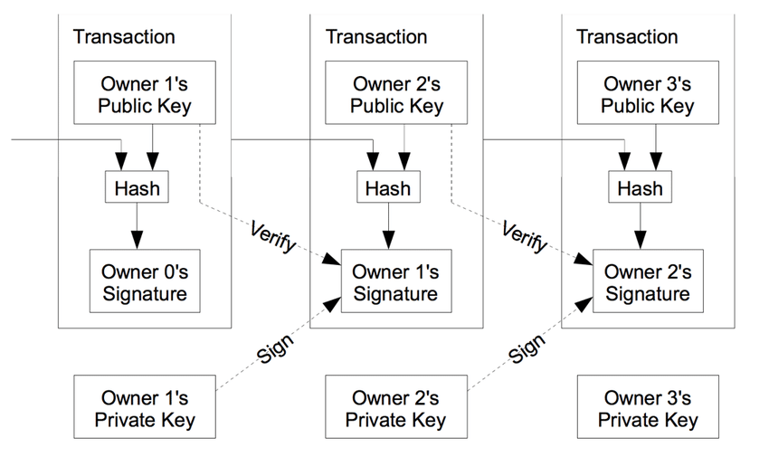

# A Basic Blockchain Script in Python

 This document is to record my understanding of what a blockchain is.

 ## Blockchain is a way of storing digital data. The data can literally be anything. For Bitcoin, it’s the transactions (logs of transfers of Bitcoin from one account to another), but it can even be files; it doesn’t matter. The data is stored in the form of blocks, which are linked (or chained) together using cryptographic hashes — hence the name “blockchain.”

 - Blocks can’t be modified once added; in other words, it is append only.
 - There are specific rules for appending data to it.
 - Its architecture is distributed.

 Enforcing these constraints yields the following benefits:

 - Immutability and durability of data
 - No single point of control or failure
 
 A verifiable audit trail of the order in which data was added

 For starters, I went through the original paper by Satoshi Nakamoto. It's in the offical bitcon website. https://bitcoin.org/bitcoin.pdf

 These are stuff that I learned from the paper

  

 This diagram represents transaction that take place in a usual blockhain server. Note this is in refrence to bitcoin. 

    Each owner transfers the coin to the next by digitally signing a hash of the previous transaction and the public key of the next owner and adding these to the end of the coin. A payee can verify the signatures to verify the chain of ownership

 Now this is how Satoshi explains how bitcoin tansactions take place in a blockchain server. Each transaction contains the information of the sender and reciever encryoted by SHA-256.

 ## Structure of each block

    - Index
    - Timestamps
    - Transactions lists
    - Proof
    - Previous Block Hash

 ## Import Functions and their purpose

   ### Block

    - __init__(self)
      - This function initialises an empty chain and a transactions list

    - new_block(self)

    - new_transaction(self)

    - hash(block)

    - register_node()

    - valid_chain()

    - valid_proof()

    - proof_of_work()

   ### Blockchain

    - __init__(self)
      - This function initialises an empty chain and a transactions list

    - new_block(self)

    - new_transaction(self)

    - hash(block)

    - register_node()

    - valid_chain()

    - valid_proof()

    - proof_of_work()
